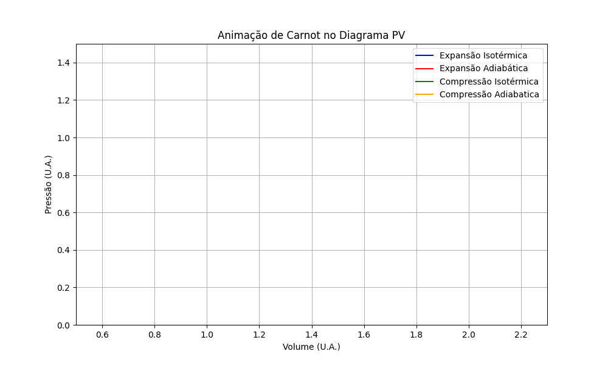

# O Ciclo de Carnot

### 200 anos de história da Termodinâmica

     

Neste ano de 2024, especificamente em 12 de junho, comemora-se 200 anos da famosa publicação "Reflexões sobre a Potência Motriz do Fogo", de Sadi Carnot. A obra é considerada o marco inicial da Termodinâmica, uma das áreas da física mais importantes da atualidade.

### Sadi Carnot

Nicolas Léonard Sadi Carnot, ou simplesmente Sadi Carnot foi um engenheiro militar francês, nascido em Paris em 1796. Seu pai, Lazare Carnot, foi um importante matemático e político francês. Sadi Carnot estudou na École Polytechnique e na École d'application de l'artillerie et du génie.

Em 1824, com 28 anos de idade na época, Carnot publicou uma monografia com o título original francês: “Réflexions Sur la Puissance Motrice du Feu et sur les Machines Propes a Développer Cette Puissance”, em tradução direta, Reflexões sobre a Potência Motriz do Fogo.

Nesta publicação, ele propôs um modelo teórico para explicar o funcionamento das máquinas térmicas, como as máquinas a vapor.

     

### A máquina de Carnot 

O modelo de Carnot é baseado no conceito de calor latente, referindo-se à energia absorvida ou liberada por um material durante uma transição de fase. Além disso, Carnot também postulou que o calor é uma forma de energia que pode ser convertida em trabalho. O modelo ideal do ciclo consiste em duas curvas adiabáticas isotérmicas e duas reversíveis. O ciclo proporciona a máxima eficiência possível que pode ser obtida por qualquer ciclo termodinâmico. Ele é composto por quatro etapas:

**Aquecimento isotérmico**: o fluido de trabalho é aquecido a uma temperatura constante.
**Expansão adiabática**: o fluido de trabalho se expande, realizando trabalho sem troca de calor com o meio ambiente.
**Resfriamento isobárico**: o fluido de trabalho é resfriado a uma temperatura constante.
**Compressão adiabática**: o fluido de trabalho é comprimido, recuperando a sua forma original.

O ciclo de Carnot é o ciclo mais eficiente possível para uma máquina térmica. A sua eficiência é dada pela seguinte fórmula:

$$
η = 1 - Tc/Th
$$

Onde:

**η** é a eficiência da máquina térmica
**Tc** é a temperatura da fonte fria
**Th** é a temperatura da fonte quente

<!-- O trabalho realizado por uma máquina térmica é proporcional à diferença de temperatura entre as fontes quente e fria. Portanto, quanto maior for a diferença de temperatura, maior será a eficiência da máquina.
 -->

### O ciclo de Carnot

Vamos considerar um protótipo de máquina térmica extremamente simples, que denominamos máquina ideal ou máquina de Carnot. Esta máquina é caracterizada por processos termodinâmicos reversíveis e transferências de energia realizadas sem perdas por atrito ou turbulência. 

Essa abordagem permite analisar o caráter geral de uma máquina térmica, desconsiderando as complexidades inerentes às máquinas reais. Vale ressaltar que essa análise é puramente teórica. 

<iframe src="docs/ciclos/Carnot/carnot_graph_animado.html" allowfullscreen="allowfullscreen"></iframe>
<!-- width="largura" height="altura" frameborder="0"  -->
